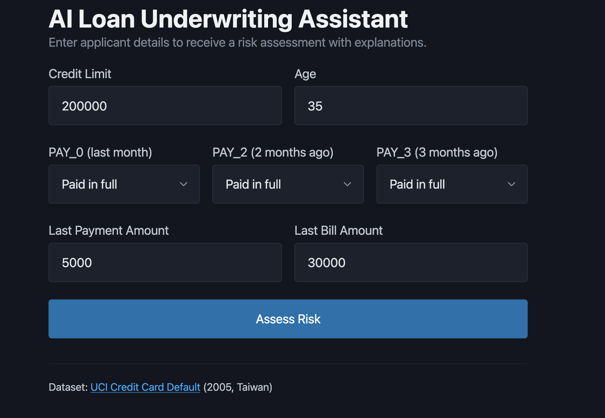
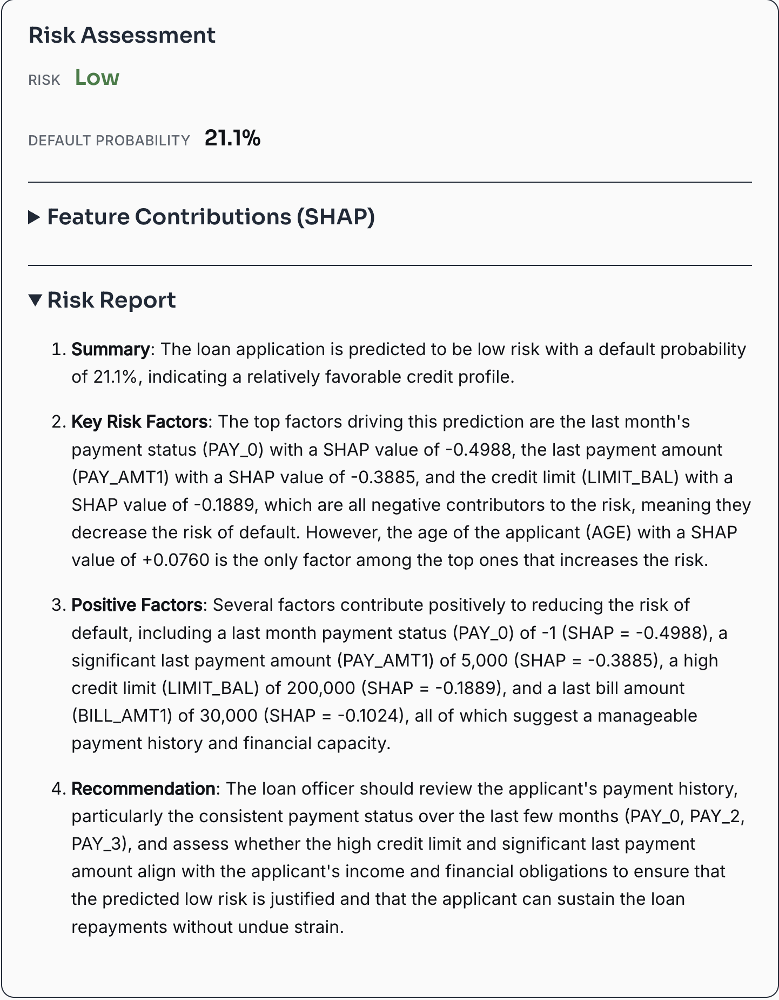
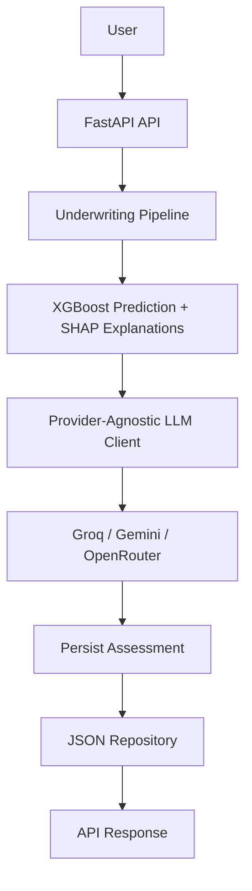

# AI Loan Underwriting Assistant

[](https://www.python.org/)
[](https://fastapi.tiangolo.com)
[](https://xgboost.readthedocs.io/)
[](LICENSE)

An AI-powered loan underwriting system that predicts default risk using XGBoost, explains decisions with SHAP values, and generates natural-language risk reports via LLMs.

## Features

- **Risk Prediction** — XGBoost classifier trained on 7 features from the UCI Credit Card Default dataset (F1 ~0.53, ROC AUC ~0.76)
- **Explainable AI** — SHAP `TreeExplainer` shows which features drove each decision, sorted by impact
- **AI Risk Reports** — Generates human-readable assessment reports via Groq, Gemini, or OpenRouter (auto fallback)
- **Production API** — FastAPI with Pydantic v2 validation, async lifespan, OpenAPI docs at `/docs`
- **Minimal Frontend** — Pico CSS single-page app at `GET /`
- **Docker Ready** — Multi-platform container with `--env-file` for secrets
- **Tested** — pytest suite with 7 tests for predictor, SHAP, and risk labels

## Screenshots




## Why this project?

Traditional credit risk models provide a prediction but often fail to explain *why* a decision was made in a way that loan officers can understand.

This project combines machine learning, explainable AI (SHAP), and large language models to generate transparent underwriting reports while remaining provider-agnostic through automatic LLM fallback.

## Architecture


The underwriting pipeline separates prediction, explanation, report generation, and persistence into independent components, making it easy to replace models or LLM providers without modifying the orchestration logic.

## Quick Start

### Prerequisites

- Python 3.9+
- LLM API key (Groq recommended — free tier available)

### Local Setup

```bash
# Clone and enter the project
git clone https://github.com/NameRectified/ai-loan-underwriting-assistant.git
cd ai-loan-underwriting-assistant

# Create virtual environment
python3 -m venv venv
source venv/bin/activate

# Install dependencies
pip install -r requirements.txt

# Set up environment variables
cp .env.example .env
# Edit .env with your API keys (see below)

# Run the server
./run.sh
```

Open http://127.0.0.1:8000 in your browser.

To use a different port (e.g. when 8000 is already in use):

```bash
PORT=8001 ./run.sh
# then open http://127.0.0.1:8001
```

### Environment Variables

```env
GROQ_API_KEY=gsk_...          # Primary (recommended)
GEMINI_API_KEY=AIza...        # Fallback 1
OPENROUTER_API_KEY=sk-or-...  # Fallback 2
```

## Project Structure

```
├── app/
│   ├── main.py              # FastAPI entry point
│   ├── api/schemas.py       # Pydantic request/response models
│   ├── config/settings.py   # Environment config via pydantic-settings
│   ├── services/
│   │   ├── predictor.py     # XGBoost + SHAP prediction
│   │   ├── llm_client.py    # Provider-agnostic LLM client
│   │   ├── report_generator.py  # Builds prompts, calls LLM
│   │   └── pipeline.py      # Orchestrates predict → report → persist
│   ├── database/repository.py   # JSON file persistence
│   └── static/index.html    # Frontend
├── models/model.pkl         # Trained XGBoost model
├── prompts/report.yaml      # LLM prompt templates
├── training/train.py        # Model training script
├── tests/test_pipeline.py   # pytest suite
├── Dockerfile               # Container build
├── .dockerignore
├── run.sh                   # Cross-platform launcher
└── requirements.txt
└── assets/                 # Screenshots
```

## API

### `POST /api/v1/predict`

```json
{
  "limit_bal": 200000,
  "age": 35,
  "pay_0": -1,
  "pay_2": -1,
  "pay_3": -1,
  "pay_amt1": 5000,
  "bill_amt1": 30000
}
```

Returns risk category, probability, 7 SHAP explanations, and an LLM-generated report.

Interactive docs at http://127.0.0.1:8000/docs.

## Docker

```bash
docker build -t loan-underwriter .
docker run --env-file .env -p 8000:8000 loan-underwriter
```

## Tests

```bash
pytest tests/ -v
```

## Design Decisions

See [.progress/DESIGN_DECISIONS.md](.progress/DESIGN_DECISIONS.md)


## Tech Stack

Backend: FastAPI, Pydantic

Machine Learning: XGBoost, SHAP, Scikit-learn

LLM: Provider-agnostic client (Groq, Gemini, OpenRouter)

Testing: pytest

Deployment: Docker

## Dataset

This project uses the UCI Credit Card Default dataset.

- 30,000 loan applications
- Binary default prediction
- 7 engineered input features


## License

MIT
